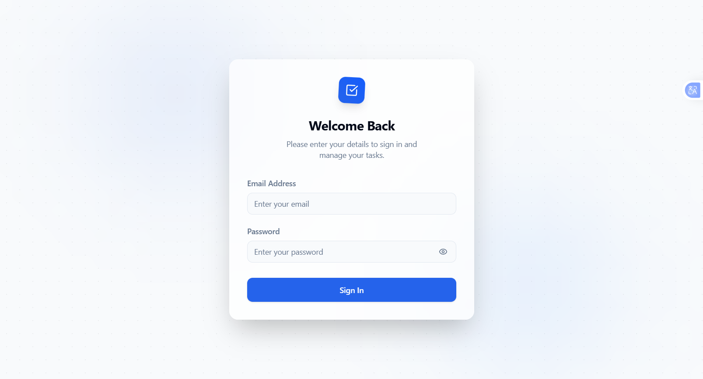
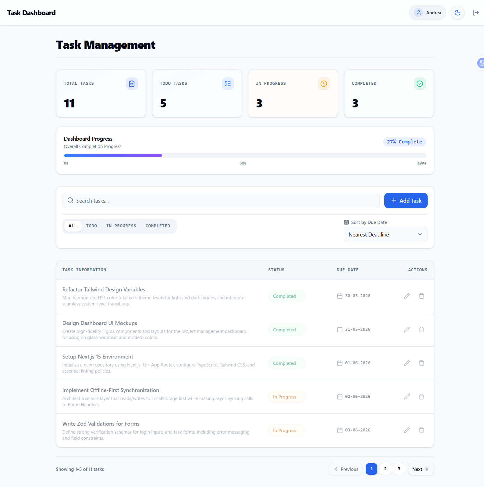
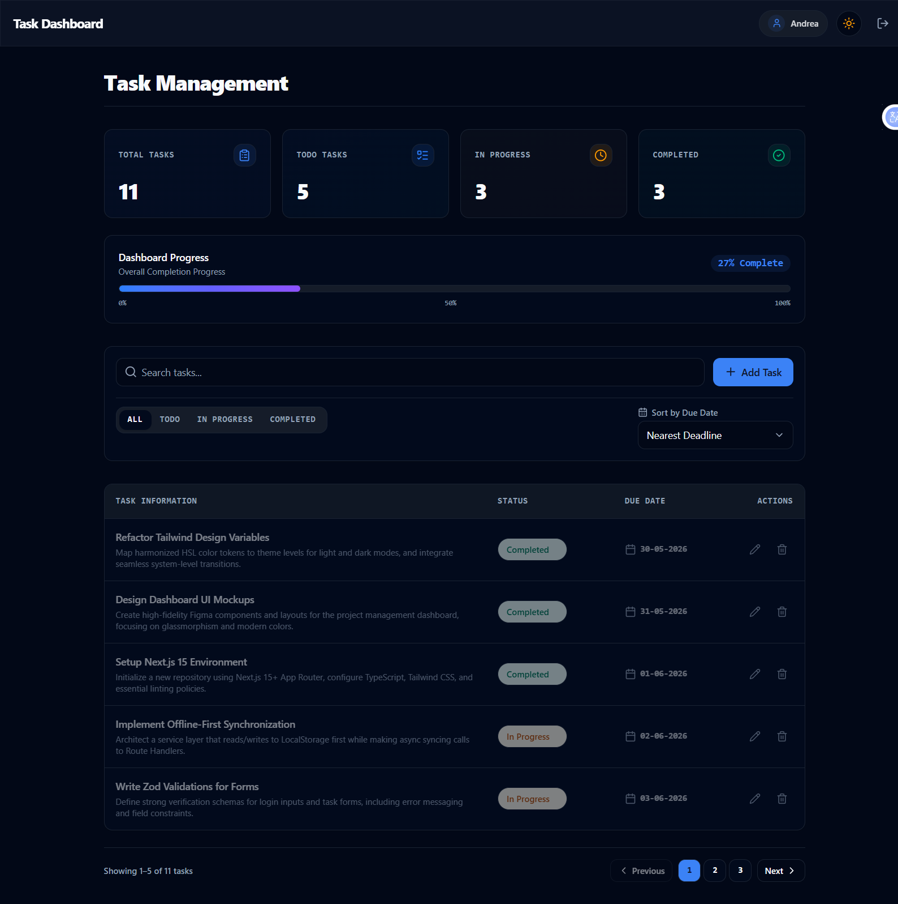
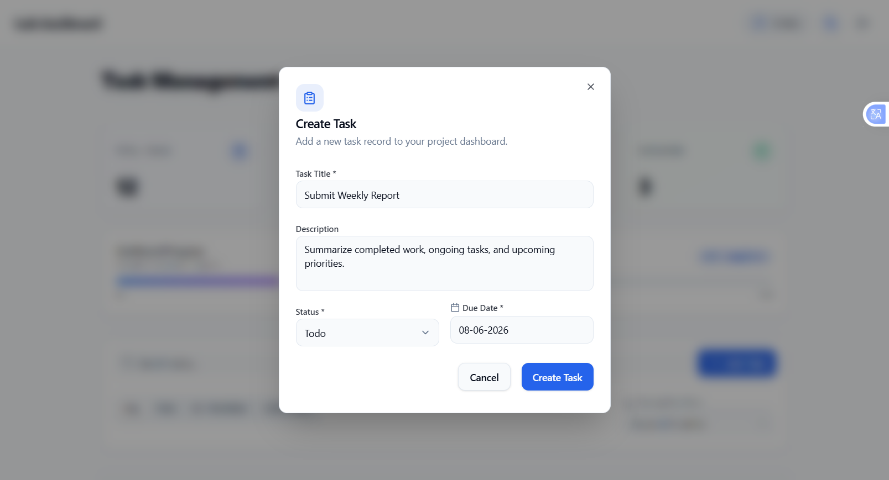
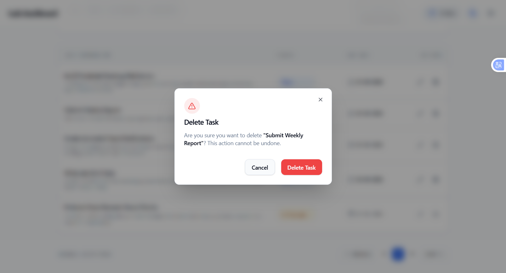

TASK MANAGEMENT DASHBOARD

A responsive task management application built with Next.js, TypeScript, Tailwind CSS, and shadcn/ui. It allows users to create, update, organize, and track tasks through a clean and intuitive interface. The project includes task filtering, sorting, search functionality, pagination, dark mode support, and a simple mock authentication system.

------------------------------------------------------------------------

FEATURES

Core Features

Mock Authentication – Simple login flow with session persistence using localStorage.
Dashboard Overview – Displays task statistics and progress information.
Task Management – Create, edit, update, and delete tasks.
Search Tasks – Search tasks by title with instant filtering.
Status Filters – Filter tasks by Todo, In Progress, and Completed status.
Due Date Sorting – Sort tasks based on their deadlines.
Pagination – Navigate tasks using client-side pagination.

Additional Features

Dark Mode – Switch between light and dark themes with saved preferences.
Responsive Design – Optimized for desktop, tablet, and mobile devices.
Toast Notifications – Feedback messages for user actions.
Unit Testing – Basic test coverage using Jest and React Testing Library.
Empty States – Helpful UI when no tasks are available.
Loading States – Loading indicators for improved user experience.
Overdue Task Indicators – Highlights tasks that have passed their due date.

------------------------------------------------------------------------------

TECH STACK

The project was developed using the following technologies:

* **Next.js 15** (App Router)
* **TypeScript** – for type-safe development
* **Tailwind CSS v4** – for styling and responsive layouts
* **shadcn/ui** – for reusable UI components
* **React Hook Form** – for form handling
* **Zod** – for form validation
* **Lucide React** – for icons
* **next-themes** – for dark mode support
* **React Context + localStorage** – for state management and data persistence
* **Next.js Route Handlers** – for mock API endpoints
* **Jest & React Testing Library** – for unit testing

------------------------------------------------------------------------------

FOLDER STRUCTURE

```
src/
├── app/
│   ├── layout.tsx              # Root layout with providers
│   ├── page.tsx                # Auto-redirect to dashboard/login
│   ├── globals.css             # Design system & animations
│   ├── login/
│   │   └── page.tsx            # Login page
│   ├── dashboard/
│   │   └── page.tsx            # Protected dashboard page
│   └── api/
│       └── tasks/
│           ├── route.ts        # GET / POST handlers
│           └── [id]/
│               └── route.ts    # PUT / DELETE handlers
│
├── components/
│   ├── auth/
│   │   ├── login-form.tsx      # Zod-validated login form
│   │   └── protected-route.tsx # Client-side route guard
│   ├── dashboard/
│   │   ├── dashboard-header.tsx# Header with theme toggle & logout
│   │   ├── stats-summary.tsx   # Task statistics cards
│   │   └── task-filters.tsx    # Search, filter, sort controls
│   ├── tasks/
│   │   ├── task-dialog.tsx     # Create/Edit task modal
│   │   ├── task-table.tsx      # Desktop table view
│   │   ├── task-card.tsx       # Mobile card view
│   │   ├── task-delete-dialog.tsx # Delete confirmation
│   │   └── task-pagination.tsx # Pagination controls
│   └── ui/
│       ├── button.tsx          # Multi-variant button
│       ├── input.tsx           # Styled text input
│       ├── textarea.tsx        # Styled textarea
│       ├── badge.tsx           # Status badges
│       ├── select.tsx          # Custom dropdown
│       ├── dialog.tsx          # Modal dialog system
│       └── toast.tsx           # Notification system
│
├── hooks/
│   ├── use-auth.ts             # Authentication hook
│   └── use-tasks.ts            # Offline-first task management
│
├── lib/
│   ├── api.ts                  # API fetch client
│   ├── mockDb.ts               # Server-side mock database
│   └── utils.ts                # Class name utilities
│
├── types/
│   └── index.ts                # TypeScript interfaces
│
├── utils/
│   └── sample-data.ts          # 10 sample task generator
│
├── providers/
│   ├── auth-provider.tsx       # Auth context provider
│   └── theme-provider.tsx      # Theme context provider
│
└── __tests__/
    ├── task-creation.test.tsx   # Task creation unit test
    └── task-filtering.test.tsx  # Task filtering unit test
```

----------------------------------------------------------------------

INSTALLATION

Prerequisites

- Node.js 18.17+ 
- npm 9+

Steps

```bash
# 1. Clone or navigate to the project directory
cd Task_manager

# 2. Install dependencies
npm install

# 3. Start the development server
npm run dev

# 4. Open in browser
# Visit http://localhost:3000
```

----------------------------------------------------------------------

RUNNING LOCALLY

```bash
# Development server (with hot reload)
npm run dev

# Production build
npm run build

# Start production server
npm start

# Run unit tests
npm test

# Run linting
npm run lint
```

---------------------------------------------------------------------

DESIGN DECISIONS

Architecture: Offline-First Synchronization

The application uses an Offline-First data strategy:
1. All read/write operations execute instantly against `localStorage` for zero-latency UI updates
2. API calls to Next.js Route Handlers run simultaneously in the background
3. This architecture simulates real-world optimistic UI patterns and can be migrated to a real backend by simply swapping the API endpoints

Authentication: Client-Side Guards

Since `localStorage` is only accessible in the browser context (not in Edge Middleware), route protection is enforced using a `ProtectedRoute` wrapper component that checks auth state on mount.

Component Design: Custom UI Primitives

All UI components (Button, Dialog, Badge, Toast, etc.) are built from scratch following shadcn/ui patterns — providing full control over styling, animations, and accessibility without external component library dependencies.

Theme System: HSL Design Tokens

Colors are defined as HSL triplets in CSS custom properties, mapped through Tailwind's `@theme` directive. This enables seamless dark/light mode transitions with a single class toggle.

Responsive Strategy: Table ↔ Card Reflow

- Desktop (md+): Rich data table with inline status dropdowns and action buttons
- Mobile (<md): Stacked card layout with touch-friendly controls
- Both views share identical data and action handlers

---------------------------------------------------------------------

FUTURE IMPROVEMENTS

-  Real backend integration (Prisma + PostgreSQL)
-  Drag-and-drop Kanban board view
-  Task priority levels (Low, Medium, High, Critical)
-  Subtasks and checklists
-  File attachments
-  Team collaboration and task assignment
-  Real-time updates via WebSockets
-  Calendar view integration
-  Task comments and activity log
-  Export to CSV/PDF
-  E2E tests with Playwright

---------------------------------------------------------------------

SCREENSHOTS

Login Page



Login screen with mock authentication.

Dashboard (Light Mode)


Dashboard overview with task statistics and management tools.

Dashboard (Dark Mode)


Dark mode version of the dashboard.

Add or Edit Task


Task creation and editing form with validation.

Delete Task Confirmation


Confirmation dialogue displayed before task deletion.

---------------------------------------------------------------------

LICENSE

This project is for demonstration and educational purposes.

---

Built with using Next.js 15, TypeScript, and Tailwind CSS.
